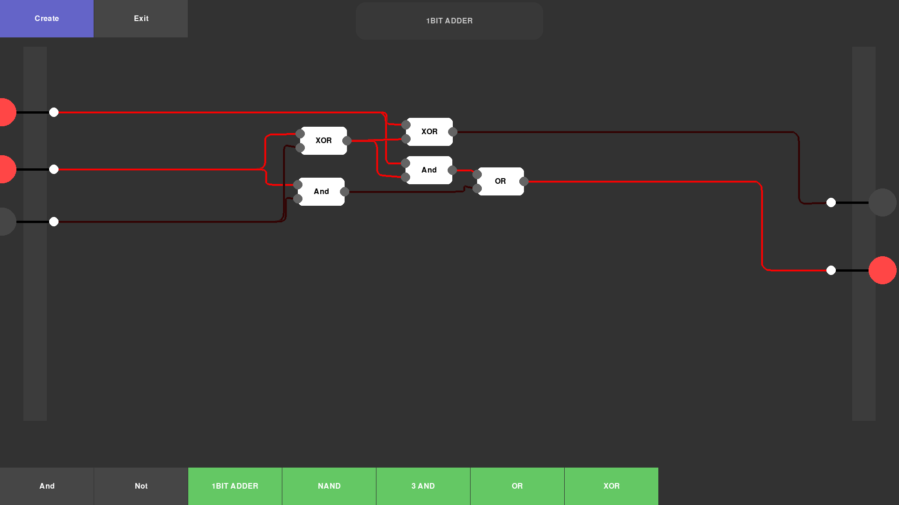

# LogicSim


Heavily inspired by Sebastian Lagues [Digital Logic Sim](https://sebastian.itch.io/digital-logic-sim),
this simulator is supposed to provide a simple interface for understanding digital logic,
learning, or even prototyping.

## Installation
Clone this repository into your desired location using <br>
```bash
git clone https://github.com/Nilusink/LogicSim
```

## Execution
For you to be able to run this program, you need to have `python3.10` or newer installed.
([Download Python](https://www.python.org/downloads/))

If you have installed python, simply run
```bash
python3.10 main.py
```
in the project directory root.
